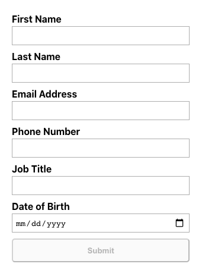
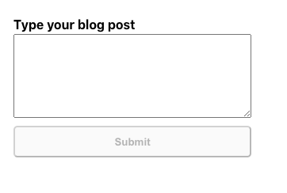

## Form component

Expects an array of objects, conditionally renders form

## Assumptions:

1. All tags passed in are type input or textarea. This implementation did not handle select for example.
2. For use in a production application, Form could receive and parse input data via a prop or rest api call called from useEffect. This example imagines the latter case, which is why formData is set into state (not strictly necessary in current implementation)
3. For use in production application, Form could post to backend via a rest api call from handleSubmission

## Potential Future Optimizations:

-   Allow Form component to receive props for custom styling for form elements
-   Modify renderJSX to check for tag type and add additional logic to handle select (assuming option fields passed in input data blob as well)
-   Add additional field validation (more than just not empty) and leverage onBlur / onFocus to conditionally render a red border or add notes for the user re missing fields

## Visuals:

Example form with default example input 
 

Example form with textarea input 
 
